# Azure Cognitive Search Overview

## The following links can be used as references for additional information within the deployment guide, if needed

> TODO: Necessary links to be added here

## Table of Contents
[Prerequisites](#prerequisites)

[Deploy Cognitive Search Resource](#deploy-azure-cognitive-search-resource)

[Enable Managed Identity](#enable-managed-identity)

[Allow Managed Identity Access to the Key Vault](#allow-managed-identity-access-to-the-key-vault)

[Create Skillset, Index, Data Source, and Indexer](#create-skillset-index-data-source-and-indexer)

[Create Shared Private Access/Links in Azure Cognitive Search](#create-shared-private-accesslinks-in-azure-cognitive-search)

[Disable Public Network Access](#disable-public-network-access)

[Enable Private Execution Environment](#enable-private-execution-environment)

## Prerequisites

1. Azure Key Vault with a Customer Managed Key (CMK) set up.
2. Cognitive Services Multi-Service Account if you want more than free tier skill capabilities.
3. Storage resource (encryption for infrastructure and data at rest required)
    * Storage Account
        * Blob, Table, or Azure Data Lake Storage Gen2 (ADLSGen2)
    * Azure Cosmos DB (SQL API)
    * Azure SQL Database
4. Virtual Network (vNet) with available subnet space for private endpoints to enable inbound access.

## Deploy and Secure Azure Cognitive Search

### Deploy Azure Cognitive Search Resource

1. Select _Create a resource_

    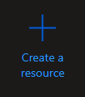

2. Search for "cognitive search"

    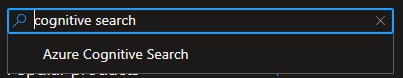

3. Select the _Azure Cognitive Search_ Plan

    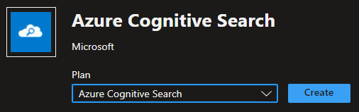

4. Fill in the necessary information for your Subscription, Resource Group, and other fields on the Basics screen.
    > You must select at least Standard2 pricing tier to enable connects to other services with private executionEnvironment in the Indexer

    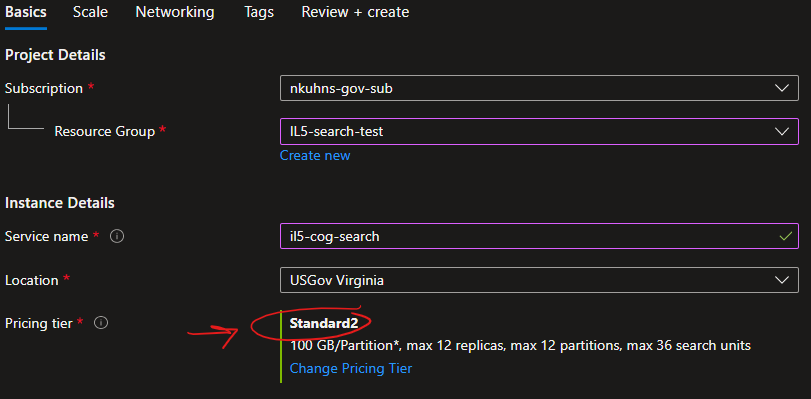

5. One the Scale screen, choose as many partitions as necessary to meet high availability requirements.

6. If a vNet already exists then one can enable a Private Endpoint in the Networking tab.

   * Select _Add_ and create the private endpoint attached to the necessary vNet and Subnet.

       > This can be done after the resource is created if necessary or preferred.

    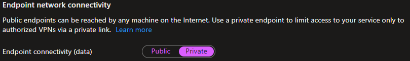

7. Add key-value tags as necessary in the Tags tab.

8. Review information in Review + Create tab, then click _Create_.

    > Deployments of Standard2 and higher pricing tiers make take significantly longer to deploy than Basic or Standard tier.

### Enable Managed Identity

1. Select _Identity_ from the left-hand Settings pane of the newly created Azure Cognitive Search Resource.

    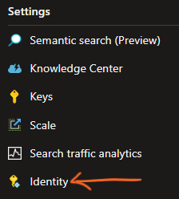

2. Under System assigned, set the Status to _On_.

    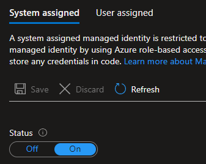

    > Be sure to select _Save_ above Status after enabling the system assigned identity.

### Allow Managed Identity Access to the Key Vault

> These steps take place in the prerequisite Key Vault resource.

1. Select _Access policies_ from the left-hand Settings pane of the Key Vault resource.

    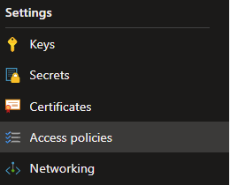

2. Select _Add Access Policy_.

    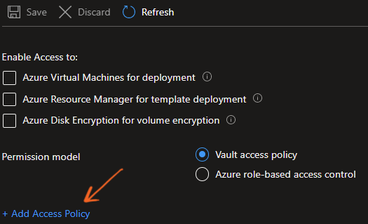

3. Select the required permissions.

   1. Under Key permissions select _Get_, _Unwrap_, and _Wrap_
   2. Under Secret select _Get_
   3. Under Certificate select _Get_

        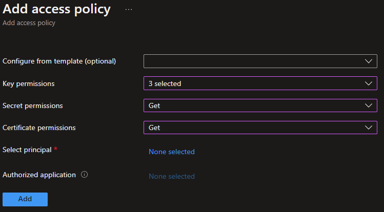

4. Click _None selected_ by "Select principal" and begin typing the name of your Azure Cognitive Search resource. Select your resource.

    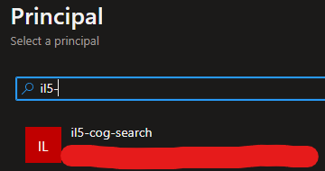

    > Be sure to Select _Save_ on the main Access Policies screen after adding the above access policy.

### Create Skillset, Index, Data Source, and Indexer

> This section requires use of the REST API. Ways to utilize this are through Azure CLI or an application such as PostMan. This is because enabling data encryption is only possible through this API.
> Each of these API bodies **must** include the _encryptionKey_ section to enable data encryption.
> It is also highly encouraged that one first creates a skillset through the portal, then pull the body from the JSON view before creating the REST API body.

1. Reference the following links to pull the most current and appropriate REST API body. The only order that matters here is that the Indexer is the final REST call made as it depends on the other three to be created first.

    * [Skillset](https://docs.microsoft.com/en-us/rest/api/searchservice/create-skillset#request-body)
    * [Index](https://docs.microsoft.com/en-us/rest/api/searchservice/create-index#request-body)
    * [Data Source](https://docs.microsoft.com/en-us/rest/api/searchservice/create-data-source#request-body)
    * [Indexer](https://docs.microsoft.com/en-us/rest/api/searchservice/create-indexer#request-body)

### Create Shared Private Access/Links in Azure Cognitive Search

1. Select _Networking_ under Settings in the left-hand pane of the Azure Cognitive Search resource.

    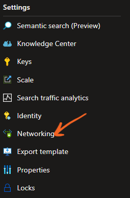

2. Select _Shared Private Access_ at the top of the Networking page and then select _Add Shared Private Access_.

    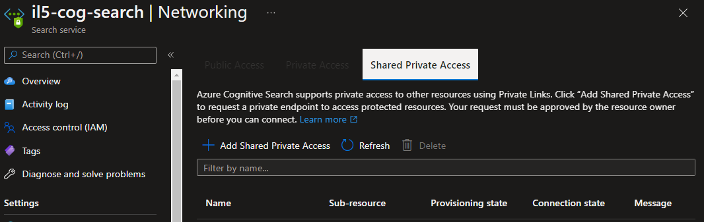

3. Create a new Shared Private Access for the Key Vault, storage resource, and any other resources you wish to connect to the Search Service.

    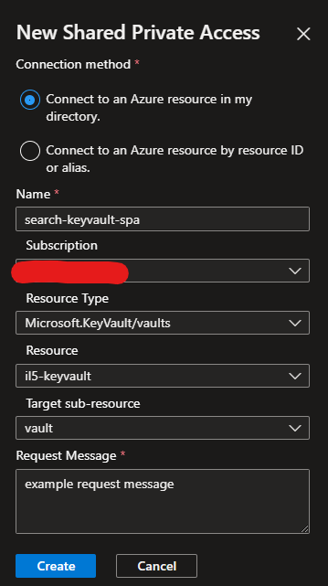

    > For ADLSGen2 resources, a Shared Private Access must be created for each of the _blob_ and _dfs_ Target sub-resource types.

4. Once complete, the Shared Private Access Link must be accepted under the Private Endpoint option in the Network space of each shared resource (Key Vault, storage, etc.).

### Disable Public Network Access

1. Select the _Public Access_ tab under the Networking option of the Azure Cognitive Search Service, select _Disabled_, and _Allow access from Portal_.

    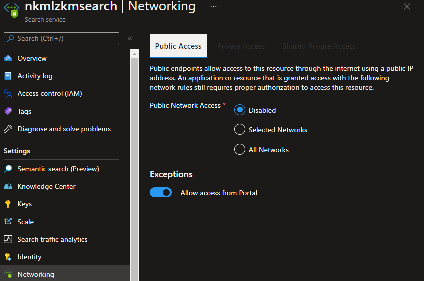

2. Select Private Access (at the top by Public Access) and click _Create a private endpoint_

    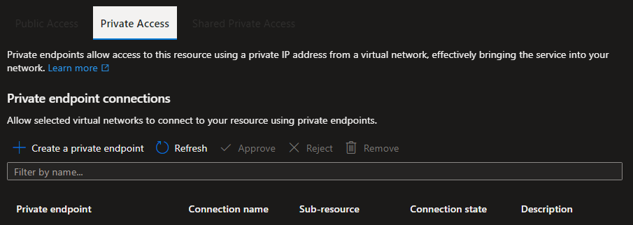

3. Enter the required information in the Basics section, including a meaningful name.

    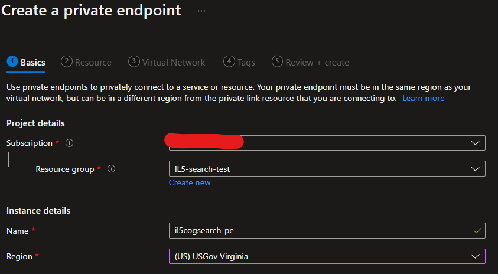

4. Under the Resource section choose _Microsoft.Search/searchServices_ as the Resource type and _searchService_ as the Target sub-resource.

    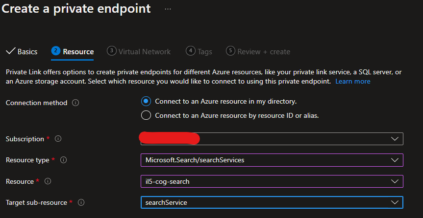

5. On the Virtual Network portion choose your predefined vNet and Subnet.
   You may select an existing DNS zone or create a new one to integrate with for proper routing of traffic. The DNS Zone should be named `privatelink.search.azure.us` to allow for correct traffic routing.

   > Ensure the DNS Zone is linked to all necessary vNets once this step is complete.

6. Add key-value tags as necessary in the Tags tab.

7. Review information in Review + Create tab, then click _Create_.

### Enable Private Execution Environment

1. On the landing page of the Azure Cognitive Search resource, select _Indexers_, choose the Indexer created with the REST API call, and then click _Indexer Definition (JSON)_.

    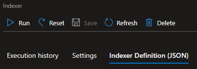

2. Add `"executionEnvironment": "private"` to the the `"configuration"` parameter and click _Save_ at the top of the page. Note that your configuration parameters may differ.

    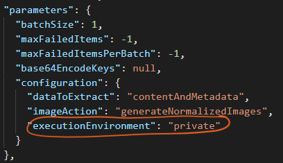

    > This line allows the Search Service to communicate to other services via the previously created Shared Private Access/Links. More details can be found [here](https://docs.microsoft.com/en-us/azure/search/search-indexer-securing-resources#step-3-force-indexers-to-run-in-the-private-environment).