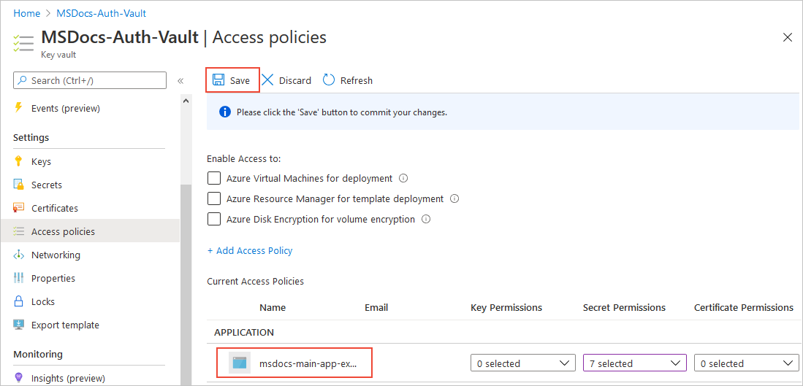
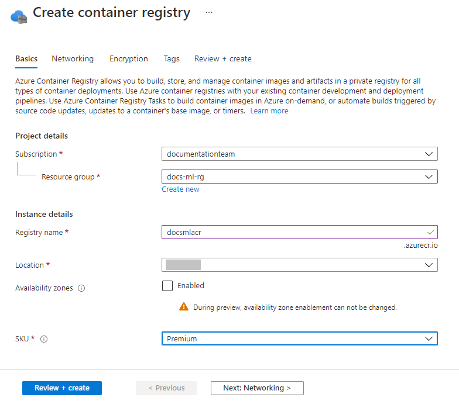
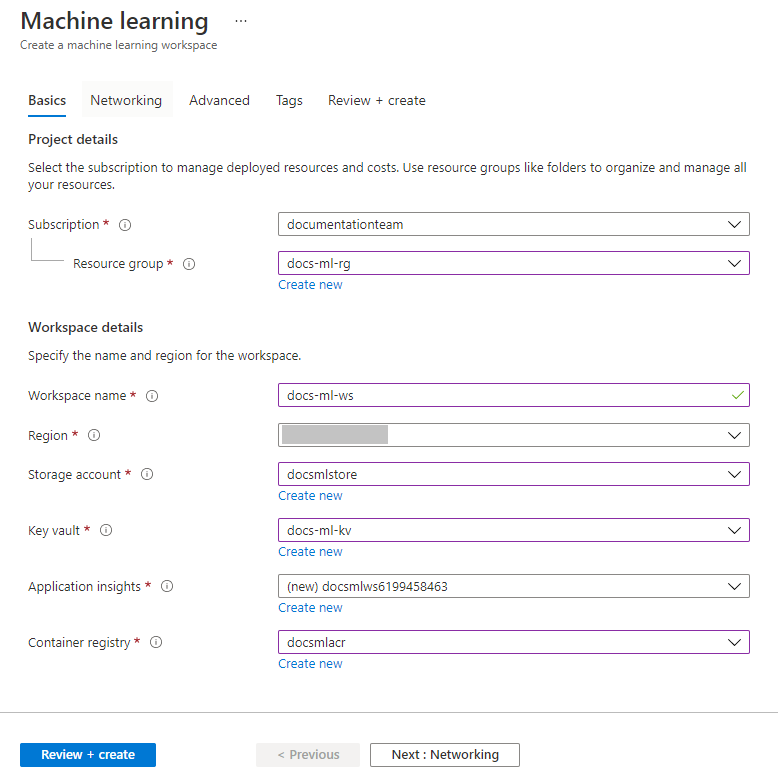
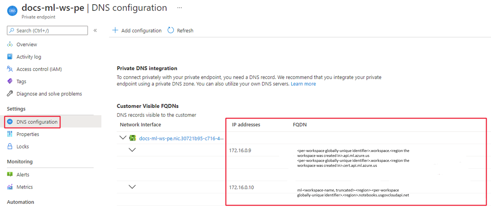

# Azure Virtual Network and Key Vault in IL5

## Overview

> Configure encryption at rest of content in Azure Machine Learning by
> using customer-managed keys in Azure Key Vault. Azure Machine Learning
> stores snapshots, output, and logs in the Azure Blob Storage account
> that\'s associated with the Azure Machine Learning workspace and
> customer subscription. All the data stored in Azure Blob Storage is
> encrypted at rest with Microsoft-managed keys. Customers can use their
> own keys for data stored in Azure Blob Storage. 

# Table of Contents 

[Azure Machine Learning in IL5](#azure-machine-learning-in-il5)

[Overview](#overview)

[Step A. Create Virtual Network](#step-a-create-virtual-network)

[Step B. Create Azure Key Vault with Customer-Managed Keys](#step-b-create-azure-key-vault-with-customer-managed-keys)

[Step C. Secure AML Workspace](#step-c-secure-aml-workspace)

[Step D: Configure Firewall and Configure Inbound and Outbound Traffic](#step-d-configure-firewall-and-configure-inbound-and-outbound-traffic)

[Step E: Secure training resources: beyond the internal compute instance
and compute clusters, make sure all computes are secure](#step-e-secure-training-resources-beyond-the-internal-compute-instance-and-compute-clusters-make-sure-all-computes-are-secure)

[Step F: Use Azure Machine Learning studio in an Azure virtual network](#step-f-use-azure-machine-learning-studio-in-an-azure-virtual-network)

[Step G: Final Check with IL5 Standards](#step-g-final-check-with-il5-standards)

## Step A. Create Virtual Network

**Sign In**

Sign in to the [Azure portal](https://portal.azure.us/).

**Create a virtual network**

To create a virtual network, use the following steps:

1.  In the Azure portal, select the portal menu in the upper left
    corner. From the menu, select **+ Create a resource** and then
    enter **Virtual Network** in the search field. Select the **Virtual
    Network** entry, and then select **Create**.


2.  From the **Basics** tab, select the Azure **subscription** to use
    for this resource and then select or create a new **resource
    group**. Under **Instance details**, enter a friendly **name** for
    your virtual network and select the **region** to create it in.


3.  Select **IP Addresses** tab. The default settings should be like the
    following image:


Use the following steps to configure the IP address and configure a
subnet for training and scoring resources:

** Tip**

While you can use a single subnet for all Azure ML resources, the steps
in this article show how to create two subnets to separate the training
& scoring resources.

The workspace and other dependency services will go into the training
subnet. They can still be used by resources in other subnets, such as
the scoring subnet.

1.  Look at the default **IPv4 address space** value. In the screenshot,
    the value is **172.17.0.0/16**. **The value may be different for
    you**. While you can use a different value, the rest of the steps in
    this tutorial are based on the **172.16.0.0/16 value**.

** Important**

We do not recommend using an address in the 172.17.0.1/16 range if you
plan on using Azure Kubernetes Services for deployment with this
cluster. The Docker bridge in Azure Kubernetes Services uses
172.17.0.1/16 as its default. Other ranges may also conflict depending
on what you want to connect to the virtual network. For example, if you
plan to connect your on premises network to the VNet, and your
on-premises network also uses the 172.16.0.0/16 range. Ultimately, it is
up to **you** to plan your network infrastructure.

2.  Select the **Default** subnet and then select **Remove subnet**.


3.  To create a subnet to contain the workspace, dependency services,
    and resources used for training, select **+ Add subnet** and set the
    subnet name and address range. The following are the values used in
    this tutorial:

    -   **Subnet name**: Training

    -   **Subnet address range**: 172.16.0.0/24


** Tip**

> If you plan on using a *service endpoint* to add your Azure Storage
> Account, Azure Key Vault, and Azure Container Registry to the VNet,
> select the following under **Services**:

-   **Microsoft.Storage**

-   **Microsoft.KeyVault**

-   **Microsoft.ContainerRegistry**

> If you plan on using a *private endpoint* to add these services to the
> VNet, you do not need to select these entries. The steps in this
> article use a private endpoint for these services, so you do not need
> to select them when following these steps.

a.  To create a subnet for compute resources used to score your models,
    select **+ Add subnet** again, and set the name and address range:

    -   **Subnet name**: Scoring

    -   **Subnet address range**: 172.16.1.0/24


** Tip**

> If you plan on using a *service endpoint* to add your Azure Storage
> Account, Azure Key Vault, and Azure Container Registry to the VNet,
> select the following under **Services**:

-   **Microsoft.Storage**

-   **Microsoft.KeyVault**

-   **Microsoft.ContainerRegistry**

> If you plan on using a *private endpoint* to add these services to the
> VNet, you do not need to select these entries. The steps in this
> article use a private endpoint for these services, so you do not need
> to select them when following these steps.

1.  Select **Security**. For **BastionHost**, select **Enable**. [Azure
    Bastion](https://learn.microsoft.com/azure/bastion/bastion-overview) provides
    a secure way to access the VM jump box you will create inside the
    VNet in a later step. Use the following values for the remaining
    fields:

    -   **Bastion name**: A unique name for this Bastion instance

    -   **AzureBastionSubnetAddress space**: 172.16.2.0/27

    -   **Public IP address**: Create a new public IP address.

Leave the other fields at the default values.


1.  Select **Review + create**.


2.  Verify that the information is correct, and then select **Create**.


**Limitations**

The steps in this article put Azure Container Registry behind the VNet.
In this configuration, you can\'t deploy models to Azure Container
Instances inside the VNet. For more information, see [Secure the
inference
environment](https://learn.microsoft.com/azure/machine-learning/v1/how-to-secure-inferencing-vnet).

** Tip**

As an alternative to Azure Container Instances, try Azure Machine Learning managed online endpoints. For more information, see [**Enable network isolation for managed online endpoints (preview)**](https://learn.microsoft.com/azure/machine-learning/how-to-secure-online-endpoint).

 

## Step B. Create Azure Key Vault with Customer-Managed Keys

**IL5 Regulations**

| Name (Azure portal) | Description |Effect(s) | Version (GitHub) |
| --- | --- | --- | --- |
| [[Preview]: Azure Key Vault should disable public network access](https://portal.azure.us/#blade/Microsoft_Azure_Policy/PolicyDetailBlade/definitionId/%2Fproviders%2FMicrosoft.Authorization%2FpolicyDefinitions%2F55615ac9-af46-4a59-874e-391cc3dfb490) | Disable public network access for your key vault so that it's not accessible over the public internet. This can reduce data leakage risks. Learn more at: [https://aka.ms/akvprivatelink](https://learn.microsoft.com/azure/key-vault/general/private-link-service). | Audit, Deny, Disabled | [1.1.0-preview](https://github.com/Azure/azure-policy/blob/master/built-in-policies/policyDefinitions/Azure%20Government/Key%20Vault/AzureKeyVaultFirewallEnabled_Audit.json) |
| [Azure Machine Learning workspaces should be encrypted with a customer-managed key](https://portal.azure.us/#blade/Microsoft_Azure_Policy/PolicyDetailBlade/definitionId/%2Fproviders%2FMicrosoft.Authorization%2FpolicyDefinitions%2Fba769a63-b8cc-4b2d-abf6-ac33c7204be8) | Manage encryption at rest of Azure Machine Learning workspace data with customer-managed keys. By default, customer data is encrypted with service-managed keys, but customer-managed keys are commonly required to meet regulatory compliance standards. Customer-managed keys enable the data to be encrypted with an Azure Key Vault key created and owned by you. You have full control and responsibility for the key lifecycle, including rotation and management. Learn more at [https://aka.ms/azureml-workspaces-cmk](https://learn.microsoft.com/azure/machine-learning/how-to-create-workspace-template#deploy-an-encrypted-workspace%22). | Audit, Deny, Disabled | [1.0.3](https://github.com/Azure/azure-policy/blob/master/built-in-policies/policyDefinitions/Azure%20Government/Machine%20Learning/Workspace_CMKEnabled_Audit.json) |
| [Key vaults should have purge protection enabled](https://portal.azure.us/#blade/Microsoft_Azure_Policy/PolicyDetailBlade/definitionId/%2Fproviders%2FMicrosoft.Authorization%2FpolicyDefinitions%2F0b60c0b2-2dc2-4e1c-b5c9-abbed971de53) | Malicious deletion of a key vault can lead to permanent data loss. A malicious insider in your organization can potentially delete and purge key vaults. Purge protection protects you from insider attacks by enforcing a mandatory retention period for soft deleted key vaults. No one inside your organization or Microsoft will be able to purge your key vaults during the soft delete retention period. | Audit, Deny, Disabled | [2.0.0](https://github.com/Azure/azure-policy/blob/master/built-in-policies/policyDefinitions/Key%20Vault/KeyVault_Recoverable_Audit.json) |
| [Key vaults should have soft delete enabled](https://portal.azure.us/#blade/Microsoft_Azure_Policy/PolicyDetailBlade/definitionId/%2Fproviders%2FMicrosoft.Authorization%2FpolicyDefinitions%2F1e66c121-a66a-4b1f-9b83-0fd99bf0fc2d) | Deleting a key vault without soft delete enabled permanently deletes all secrets, keys, and certificates stored in the key vault. Accidental deletion of a key vault can lead to permanent data loss. Soft delete allows you to recover an accidentally deleted key vault for a configurable retention period. | Audit, Deny, Disabled | [2.0.0](https://github.com/Azure/azure-policy/blob/master/built-in-policies/policyDefinitions/Key%20Vault/KeyVault_SoftDeleteMustBeEnabled_Audit.json) |
| [Resource logs in Key Vault should be enabled](https://portal.azure.us/#blade/Microsoft_Azure_Policy/PolicyDetailBlade/definitionId/%2Fproviders%2FMicrosoft.Authorization%2FpolicyDefinitions%2Fcf820ca0-f99e-4f3e-84fb-66e913812d21) | Audit enabling of resource logs. This enables you to recreate activity trails to use for investigation purposes when a security incident occurs or when your network is compromised | AuditIfNotExists, Disabled | [5.0.0](https://github.com/Azure/azure-policy/blob/master/built-in-policies/policyDefinitions/Key%20Vault/KeyVault_AuditDiagnosticLog_Audit.json) |


 **Configure encryption with customer-managed keys stored in Azure Key
Vault**

Azure Storage encrypts all data in a storage account at rest. By
default, data is encrypted with Microsoft-managed keys. For additional
control over encryption keys, you can manage your own keys.
Customer-managed keys must be stored in Azure Key Vault or Key Vault
Managed Hardware Security Model (HSM).

This article shows how to configure encryption with customer-managed
keys stored in a key vault by using the [Azure
portal](https://portal.azure.us/), PowerShell, or Azure CLI. To learn
how to configure encryption with customer-managed keys stored in a
managed HSM, see [Configure encryption with customer-managed keys stored
in Azure Key Vault Managed
HSM](https://learn.microsoft.com/azure/storage/common/customer-managed-keys-configure-key-vault-hsm).

** Note**

Azure Key Vault and Azure Key Vault Managed HSM support the same APIs
and management interfaces for configuration.

**Configure a key vault**

You can use a new or existing key vault to store customer-managed keys.
The storage account and key vault may be in different regions or
subscriptions in the same tenant. To learn more about Azure Key Vault,
see [Azure Key Vault
Overview](https://learn.microsoft.com/azure/key-vault/general/overview) and [What
is Azure Key
Vault?](https://learn.microsoft.com/azure/key-vault/general/basic-concepts).

Using customer-managed keys with Azure Storage encryption requires that
both soft delete and purge protection be enabled for the key vault**.
Soft delete is enabled by default when you create a new key vault and
cannot be disabled**. You can enable purge protection either when you
create the key vault or after it is created.

To learn how to create a key vault with the [Azure
portal](https://portal.azure.us/), see [Quickstart: Create a key vault
using the Azure
portal](https://learn.microsoft.com/azure/key-vault/general/quick-create-portal).
When you create the key vault, select **Enable purge protection**, as
shown in the following image.


To enable purge protection on an existing key vault, follow these steps:

1.  Navigate to your key vault in the [Azure
    portal](https://portal.azure.us/).

2.  Under **Settings**, choose **Properties**.

3.  In the **Purge protection** section, choose **Enable purge
    protection**.

**Establish a private link connection to Key Vault using the Azure
portal**

After configuring the key vault basics, select the Networking tab and
follow these steps:

1.  Select the Private Endpoint radio button in the Networking tab.

2.  Click the \"+ Add\" Button to add a private endpoint.


3.  In the \"Location\" field of the Create Private Endpoint Blade,
    select the region in which your virtual network is located.

4.  In the \"Name\" field, create a descriptive name that will allow you
    to identify this private endpoint.

5.  Select the virtual network and subnet you want this private endpoint
    to be created in from the dropdown menu.

6.  Leave the \"integrate with the private zone DNS\" option unchanged.

7.  Select \"Ok\".


You will now be able to see the configured private endpoint. You now
have the option to delete and edit this private endpoint. Select the
\"Review + Create\" button and create the key vault. It will take 5-10
minutes for the deployment to complete.

**Add a key**

Next, add a key to the key vault.

Azure Storage encryption supports RSA and RSA-HSM keys of sizes 2048,
3072 and 4096. For more information about supported key types,
see [About
keys](https://learn.microsoft.com/azure/key-vault/keys/about-keys).

To add a key to the vault, you just need to take a couple of additional
steps. In this case, we add a key that could be used by an application.
The key is called **ExampleKey**.

1.  On the Key Vault properties pages, select **Keys**.

2.  Click on **Generate/Import**.

3.  On the **Create a key** screen choose the following values:

    -   **Options**: Generate.

    -   **Name**: ExampleKey.

    -   Leave the other values to their defaults. Click **Create**.

**Choose a managed identity to authorize access to the key vault**

When you enable customer-managed keys for a storage account, you must
specify a managed identity that will be used to authorize access to the
key vault that contains the key. The managed identity must have
permissions to access the key in the key vault.

The managed identity that authorizes access to the key vault may be
either a user-assigned or system-assigned managed identity, depending on
your scenario:

-   When you configure customer-managed keys at the time that you create
    a storage account, you must specify a user-assigned managed
    identity.

-   When you configure customer-managed keys on an existing storage
    account, you can specify either a user-assigned managed identity or
    a system-assigned managed identity.

To learn more about system-assigned versus user-assigned managed
identities, see [Managed identity
types](https://learn.microsoft.com/azure/active-directory/managed-identities-azure-resources/overview#managed-identity-types).

**Use a user-assigned managed identity to authorize access**

A user-assigned is a standalone Azure resource. To learn how to create
and manage a user-assigned managed identity, see [Manage user-assigned
managed
identities](https://learn.microsoft.com/azure/active-directory/managed-identities-azure-resources/how-manage-user-assigned-managed-identities).

Both new and existing storage accounts can use a user-assigned identity
to authorize access to the key vault. You must create the user-assigned
identity before you configure customer-managed keys.

When you configure customer-managed keys with the [Azure
portal](https://portal.azure.us/), you can select an existing
user-assigned identity through the portal user interface. For details,
see one of the following sections:

-   [Configure customer-managed keys for a new
    account](https://learn.microsoft.com/azure/storage/common/customer-managed-keys-configure-key-vault?tabs=portal#configure-customer-managed-keys-for-a-new-account)

-   [Configure customer-managed keys for an existing
    account](https://learn.microsoft.com/azure/storage/common/customer-managed-keys-configure-key-vault?tabs=portal#configure-customer-managed-keys-for-an-existing-account)

**Use a system-assigned managed identity to authorize access**

A system-assigned managed identity is associated with an instance of an
Azure service, in this case an Azure Storage account. You must
explicitly assign a system-assigned managed identity to a storage
account before you can use the system-assigned managed identity to
authorize access to the key vault that contains your customer-managed
key.

Only existing storage accounts can use a system-assigned identity to
authorize access to the key vault. New storage accounts must use a
user-assigned identity, if customer-managed keys are configured on
account creation.

When you configure customer-managed keys with the [Azure
portal](https://portal.azure.us/) with a system-assigned managed
identity, the system-assigned managed identity is assigned to the
storage account for you under the covers. For details, see [Configure
customer-managed keys for an existing
account](https://learn.microsoft.com/azure/storage/common/customer-managed-keys-configure-key-vault?tabs=portal#configure-customer-managed-keys-for-an-existing-account).

**Configure the key vault access policy**

The next step is to configure the key vault access policy. The key vault
access policy grants permissions to the managed identity that will be
used to authorize access to the key vault. To learn more about key vault
access policies, see [Azure Key Vault
Overview](https://learn.microsoft.com/azure/key-vault/general/overview#securely-store-secrets-and-keys) and [Azure
Key Vault security
overview](https://learn.microsoft.com/azure/key-vault/general/security-features#key-vault-authentication-options).

**Assign a Key Vault access policy**

A Key Vault access policy determines whether a given security principal,
namely a user, application or user group, can perform different
operations on Key
Vault [secrets](https://learn.microsoft.com/azure/key-vault/secrets/), [keys](https://learn.microsoft.com/azure/key-vault/keys/),
and [certificates](https://learn.microsoft.com/azure/key-vault/certificates/).
You can assign access policies using the [Azure
portal](https://learn.microsoft.com/azure/key-vault/general/assign-access-policy-portal),
the Azure CLI, or [Azure
PowerShell](https://learn.microsoft.com/azure/key-vault/general/assign-access-policy-powershell).

Key vault supports up to 1024 access policy entries, with each entry
granting a distinct set of permissions to a particular security
principal. Because of this limitation, we recommend assigning access
policies to groups of users, where possible, rather than individual
users. Using groups makes it much easier to manage permissions for
multiple people in your organization. For more information, see [Manage
app and resource access using Azure Active Directory
groups](https://learn.microsoft.com/azure/active-directory/fundamentals/active-directory-manage-groups)

**Assign an access policy**

1.  In the [Azure portal](https://portal.azure.us/), navigate to the Key
    Vault resource.

2.  Under **Settings**, select **Access policies**, then select **Add
    Access Policy**:


3.  Select the permissions you want under **Certificate
    permissions**, **Key permissions**, and **Secret permissions**. You
    can also select a template that contains common permission
    combinations:


4.  Under **Select principal**, choose the **None selected** link to
    open the **Principal** selection pane. Enter the name of the user,
    app or service principal in the search field, select the appropriate
    result, then choose **Select**.


If you\'re using a managed identity for the app, search for and select
the name of the app itself. (For more information on security
principals, see [Key Vault
authentication](https://learn.microsoft.com/azure/key-vault/general/authentication).

5.  Back in the **Add access policy** pane, select **Add** to save the
    access policy.


6.  Back on the **Access policies** page, verify that your access policy
    is listed under **Current Access Policies**, then select **Save**.
    Access policies aren\'t applied until you save them.



**Configure customer-managed keys for a new account**

When you configure encryption with customer-managed keys for a new
storage account, you can choose to automatically update the key version
used for Azure Storage encryption whenever a new version is available in
the associated key vault. Alternately, you can explicitly specify a key
version to be used for encryption until the key version is manually
updated.

You must use an existing user-assigned managed identity to authorize
access to the key vault when you configure customer-managed keys while
creating the storage account. The user-assigned managed identity must
have appropriate permissions to access the key vault.

To configure customer-managed keys for a new storage account with
automatic updating of the key version, follow these steps:

1.  In the [Azure portal](https://portal.azure.us/), navigate to
    the **Storage accounts** page, and select the **Create** button to
    create a new account.

2.  Follow the steps outlined in [Create a storage
    account](https://learn.microsoft.com/azure/storage/common/storage-account-create) to
    fill out the fields on the **Basics**, **Advanced**, **Networking**,
    and **Data Protection** tabs.

3.  On the **Encryption** tab, indicate for which services you want to
    enable support for customer-managed keys in the **Enable support for
    customer-managed keys** field.

4.  In the **Encryption type** field, select **Customer-managed keys
    (CMK)**.

5.  In the **Encryption key** field, choose **Select a key vault and
    key**, and specify the key vault and key.

6.  For the **User-assigned identity** field, select an existing
    user-assigned managed identity.


7.  Select **Review + create** to validate and create the new account.

You can also configure customer-managed keys with manual updating of the
key version when you create a new storage account. Follow the steps
described in [Configure encryption for manual updating of key
versions](https://learn.microsoft.com/azure/storage/common/customer-managed-keys-configure-key-vault?tabs=portal#configure-encryption-for-manual-updating-of-key-versions).

**Configure customer-managed keys for an existing account**

When you configure encryption with customer-managed keys for an existing
storage account, you can choose to automatically update the key version
used for Azure Storage encryption whenever a new version is available in
the associated key vault. Alternately, you can explicitly specify a key
version to be used for encryption until the key version is manually
updated.

You can use either a system-assigned or user-assigned managed identity
to authorize access to the key vault when you configure customer-managed
keys for an existing storage account.

** Note**

To rotate a key, create a new version of the key in Azure Key Vault.
Azure Storage does not handle key rotation, so you will need to manage
rotation of the key in the key vault. You can [**configure key
auto-rotation in Azure Key
Vault**](https://learn.microsoft.com/azure/key-vault/keys/how-to-configure-key-rotation) or
rotate your key manually.

**Configure encryption for automatic updating of key versions**

Azure Storage can automatically update the customer-managed key that is
used for encryption to use the latest key version from the key vault.
Azure Storage checks the key vault daily for a new version of the key.
When a new version becomes available, then Azure Storage automatically
begins using the latest version of the key for encryption.

** Important**

Azure Storage checks the key vault for a new key version only once
daily. When you rotate a key, be sure to wait 24 hours before disabling
the older version.

To configure customer-managed keys for an existing account with
automatic updating of the key version in the Azure portal, follow these
steps:

1.  Navigate to your storage account.

2.  On the **Settings** blade for the storage account,
    click **Encryption**. By default, key management is set
    to **Microsoft Managed Keys**, as shown in the following image.


3.  Select the **Customer Managed Keys** option.

4.  Choose the **Select from Key Vault** option.

5.  Select **Select a key vault and key**.

6.  Select the key vault containing the key you want to use. You can
    also create a new key vault.

7.  Select the key from the key vault. You can also create a new key.


8.  Select the type of identity to use to authenticate access to the key
    vault. The options include **System-assigned** (the default)
    or **User-assigned**. To learn more about each type of managed
    identity, see [Managed identity
    types](https://learn.microsoft.com/azure/active-directory/managed-identities-azure-resources/overview#managed-identity-types).

    1.  If you select **System-assigned**, the system-assigned managed
        identity for the storage account is created under the covers, if
        it does not already exist.

    2.  If you select **User-assigned**, then you must select an
        existing user-assigned identity that has permissions to access
        the key vault. To learn how to create a user-assigned identity,
        see [Manage user-assigned managed
        identities](https://learn.microsoft.com/azure/active-directory/managed-identities-azure-resources/how-manage-user-assigned-managed-identities).


1.  Save your changes.

After you\'ve specified the key, the Azure portal indicates that
automatic updating of the key version is enabled and displays the key
version currently in use for encryption. The portal also displays the
type of managed identity used to authorize access to the key vault and
the principal ID for the managed identity.


**Configure encryption for manual updating of key versions**

If you prefer to manually update the key version, then explicitly
specify the version at the time that you configure encryption with
customer-managed keys. In this case, Azure Storage will not
automatically update the key version when a new version is created in
the key vault. To use a new key version, you must manually update the
version used for Azure Storage encryption.

To configure customer-managed keys with manual updating of the key
version in the Azure portal, specify the key URI, including the version.
To specify a key as a URI, follow these steps:

1.  To locate the key URI in the [Azure
    portal](https://portal.azure.us/), navigate to your key vault, and
    select the **Keys** setting. Select the desired key, then click the
    key to view its versions. Select a key version to view the settings
    for that version.

2.  Copy the value of the **Key Identifier** field, which provides the
    URI.


3.  In the **Encryption key** settings for your storage account, choose
    the **Enter key URI** option.

4.  Paste the URI that you copied into the **Key URI** field. Omit the
    key version from the URI to enable automatic updating of the key
    version.


5.  Specify the subscription that contains the key vault.

6.  Specify either a system-assigned or user-assigned managed identity.

7.  Save your changes.

See the Azure Documentation for:

-   How to change the key

-   How to revoke customer-managed keys

-   How to Disable customer-managed keys

## Step C. Secure AML Workspace

**Create a container registry**

1.  In the [Azure portal](https://portal.azure.us/), select the portal
    menu in the upper left corner. From the menu, select **+ Create a
    resource** and then enter **Container Registry**. Select
    the **Container Registry** entry, and then select **Create**.

2.  From the **Basics** tab, select the **subscription**, **resource
    group**, and **location** you previously used for the virtual
    network. Enter a unique **Registry name** and set
    the **SKU** to **Premium**.



3.  From the **Networking** tab, select **Private endpoint** and then
    select **+ Add**.


4.  On the **Create private endpoint** form, use the following values
    (or substitute your own values):

    -   **Subscription**: The same Azure subscription that contains the
        previous resources you\'ve created.

    -   **Resource group**: The same Azure resource group that contains
        the previous resources you\'ve created.

    -   **Location**: The same Azure region that contains the previous
        resources you\'ve created.

    -   **Name**: A unique name for this private endpoint.

    -   **Target sub-resource**: registry

    -   **Virtual network**: The virtual network you created earlier.

    -   **Subnet**: Training (172.16.0.0/24)

    -   **Private DNS integration**: Yes

    -   **Private DNS Zone**: privatelink.azurecr.io

Select **OK** to create the private endpoint.


1.  Select **Review + create**. Verify that the information is correct,
    and then select **Create**.

2.  After the container registry has been created, select **Go to
    resource**.


3.  From the left of the page, select **Access keys**, and then
    enable **Admin user**. This setting is required when using Azure
    Container Registry inside a virtual network with Azure Machine
    Learning.


**Create a workspace**

1.  In the [Azure portal](https://portal.azure.us/), select the portal
    menu in the upper left corner. From the menu, select **+ Create a
    resource** and then enter **Machine Learning**. Select the **Machine
    Learning** entry, and then select **Create**.


2.  From the **Basics** tab, select the **subscription**, **resource
    group**, and **Region** you previously used for the virtual network.
    Use the following values for the other fields:

    -   **Workspace name**: A unique name for your workspace.

    -   **Storage account**: Select the storage account you created
        previously.

    -   **Key vault**: Select the key vault you created previously.

    -   **Application insights**: Use the default value.

    -   **Container registry**: Use the container registry you created
        previously.



1.  From the **Networking** tab, select **Private endpoint** and then
    select **+ add**.


2.  On the **Create private endpoint** form, use the following values
    (or substitute your own values):

    -   **Subscription**: The same Azure subscription that contains the
        previous resources you\'ve created.

    -   **Resource group**: The same Azure resource group that contains
        the previous resources you\'ve created.

    -   **Location**: The same Azure region that contains the previous
        resources you\'ve created.

    -   **Name**: A unique name for this private endpoint.

    -   **Target sub-resource**: amlworkspace

    -   **Virtual network**: The virtual network you created earlier.

    -   **Subnet**: Training (172.16.0.0/24)

    -   **Private DNS integration**: Yes

    -   **Private DNS Zone**: Leave the two private DNS zones at the
        default values
        of **privatelink.api.ml.azure.us** and **privatelink.notebooks.usgovcloudapi.net**.

Select **OK** to create the private endpoint.


3.  Select **Review + create**. Verify that the information is correct,
    and then select **Create**.

4.  Once the workspace has been created, select **Go to resource**.

5.  From the **Settings** section on the left, select **Private endpoint
    connections** and then select the link in the **Private
    endpoint** column:


6.  Once the private endpoint information appears, select **DNS
    configuration** from the left of the page. Save the IP address and
    fully qualified domain name (FQDN) information on this page, as it
    will be used later.



** Important**

There are still some configuration steps needed before you can fully use
the workspace. However, these require you to connect to the workspace.

**Enable studio**

Azure Machine Learning studio is a web-based application that lets you
easily manage your workspace. However, it needs some extra configuration
before it can be used with resources secured inside a VNet. Use the
following steps to enable studio:

1.  When using an Azure Storage Account that has a private endpoint, add
    the service principal for the workspace as a **Reader** for the
    storage private endpoint(s). From the Azure portal, select your
    storage account and then select **Networking**. Next,
    select **Private endpoint connections**.


2.  For **each private endpoint listed**, use the following steps:

    1.  Select the link in the **Private endpoint** column.


2.  Select **Access control (IAM)** from the left side.

3.  Select **+ Add**, and then **Add role assignment (Preview)**.


4.  On the **Role** tab, select the **Reader**.


5.  On the **Members** tab, select **User, group, or service
    principal** in the **Assign access to** area and then select **+
    Select members**. In the **Select members** dialog, enter the name
    as your Azure Machine Learning workspace. Select the service
    principal for the workspace, and then use the **Select** button.

6.  On the **Review + assign** tab, select **Review + assign** to assign
    the role.

**Connect to the workspace**

There are several ways that you can connect to the secured workspace.
The steps in this article use a **jump box**, which is a virtual machine
in the VNet. You can connect to it using your web browser and Azure
Bastion. The following table lists several other ways that you might
connect to the secure workspace:

| **Method** | **Description** |
| --- | --- |
| [Azure VPN gateway](https://learn.microsoft.com/azure/vpn-gateway/vpn-gateway-about-vpngateways) | Connects on-premises networks to the VNet over a private connection. Connection is made over the public internet. |
| [ExpressRoute](https://azure.microsoft.com/services/expressroute/) | Connects on-premises networks into the cloud over a private connection. Connection is made using a connectivity provider. |

** Important**

When using a **VPN gateway** or **ExpressRoute**, you will need to plan
how name resolution works between your on-premises resources and those
in the VNet. For more information, see [**Use a custom DNS
server**](https://learn.microsoft.com/azure/machine-learning/how-to-custom-dns).

**Create a jump box (VM)**

Use the following steps to create a Data Science Virtual Machine for use
as a jump box:

1.  In the [Azure portal](https://portal.azure.us/), select the portal
    menu in the upper left corner. From the menu, select **+ Create a
    resource** and then enter **Data science virtual machine**. Select
    the **Data science virtual machine - Windows** entry, and then
    select **Create**.

2.  From the **Basics** tab, select the **subscription**, **resource
    group**, and **Region** you previously used for the virtual network.
    Provide values for the following fields:

    -   **Virtual machine name**: A unique name for the VM.

    -   **Username**: The username you will use to login to the VM.

    -   **Password**: The password for the username.

    -   **Security type**: Standard.

    -   **Image**: Data Science Virtual Machine - Windows Server 2019 -
        Gen1.

** Important**

Do not select a Gen2 image.

3.  You can leave other fields at the default values.

4.  

```{=html}
<!-- -->
```
1.  Select **Networking**, and then select the **Virtual network** you
    created earlier. Use the following information to set the remaining
    fields:

    -   Select the **Training** subnet.

    -   Set the **Public IP** to **None**.

    -   Leave the other fields at the default value.


2.  Select **Review + create**. Verify that the information is correct,
    and then select **Create**.

**Connect to the jump box**

1.  Once the virtual machine has been created, select **Go to
    resource**.

2.  From the top of the page, select **Connect** and then **Bastion**.


3.  Select **Use Bastion**, and then provide your authentication
    information for the virtual machine, and a connection will be
    established in your browser.


**Create a compute cluster and compute instance**

A compute cluster is used by your training jobs. A compute instance
provides a Jupyter Notebook experience on a shared compute resource
attached to your workspace.

1.  From an Azure Bastion connection to the jump box, open
    the **Microsoft Edge** browser on the remote desktop.

2.  In the remote browser session, go
    to** <https://studio.azure.ml.us>**. When prompted, authenticate
    using your Azure AD account.

3.  From the **Welcome to studio!** screen, select the **Machine
    Learning workspace** you created earlier and then select **Get
    started**.

** Tip**

If your Azure AD account has access to multiple subscriptions or
directories, use the **Directory and Subscription** dropdown to select
the one that contains the workspace.


4.  From studio, select **Compute**, **Compute clusters**, and then **+
    New**.


5.  From the **Virtual Machine** dialog, select **Next** to accept the
    default virtual machine configuration.


6.  From the **Configure Settings** dialog, enter **cpu-cluster** as
    the **Compute name**. Set the **Subnet** to **Training** and then
    select **Create** to create the cluster.

** Tip**

Compute clusters dynamically scale the nodes in the cluster as needed.
We recommend leaving the minimum number of nodes at 0 to reduce costs
when the cluster is not in use.


7.  From studio, select **Compute**, **Compute instance**, and then **+
    New**.


8.  From the **Virtual Machine** dialog, enter a unique **Computer
    name** and select **Next: Advanced Settings**.


9.  From the **Advanced Settings** dialog, set
    the **Subnet** to **Training**, and then select **Create**.


** Tip**

When you create a compute cluster or compute instance, Azure Machine
Learning dynamically adds a Network Security Group (NSG). This NSG
contains the following rules, which are specific to compute cluster and
compute instance:

-   Allow inbound TCP traffic on ports 29876-29877 from
    the BatchNodeManagement service tag.

-   Allow inbound TCP traffic on port 44224 from
    the AzureMachineLearning service tag.

The following screenshot shows an example of these rules:


For more information on creating a compute cluster and compute cluster,
including how to do so with Python and the CLI, see the following
articles:

-   [Create a compute
    cluster](https://learn.microsoft.com/azure/machine-learning/how-to-create-attach-compute-cluster)

-   [Create a compute
    instance](https://learn.microsoft.com/azure/machine-learning/how-to-create-manage-compute-instance)

**Configure image builds**

**APPLIES TO:**  [Azure CLI ml extension **v2
(current)**](https://learn.microsoft.com/azure/machine-learning/how-to-configure-cli)

When Azure Container Registry is behind the virtual network, Azure
Machine Learning can\'t use it to directly build Docker images (used for
training and deployment). Instead, configure the workspace to use the
compute cluster you created earlier. Use the following steps to create a
compute cluster and configure the workspace to use it to build images:

1.  Navigate to <https://portal.azure.us/#cloudshell/> to open the Azure
    Cloud Shell.

2.  From the Cloud Shell, use the following command to install the 1.0
    CLI for Azure Machine Learning:

Azure CLI

az extension add -n ml

3.  To update the workspace to use the compute cluster to build Docker
    images. Replace docs-ml-rg with your resource group.
    Replace docs-ml-ws with your workspace. Replace cpu-cluster with the
    compute cluster to use:

Azure CLI

> az ml workspace update \\
>
> -n myworkspace \\
>
> -g myresourcegroup \\
>
> -i mycomputecluster

** Note**

You can use the same compute cluster to train models and build Docker
images for the workspace.

**Use the workspace**

** Important**

The steps in this article put Azure Container Registry behind the VNet.
In this configuration, you cannot deploy a model to Azure Container
Instances inside the VNet. We do not recommend using Azure Container
Instances with Azure Machine Learning in a virtual network. For more
information, see [**Secure the inference
environment**](https://learn.microsoft.com/azure/machine-learning/v1/how-to-secure-inferencing-vnet).

As an alternative to Azure Container Instances, try Azure Machine
Learning managed online endpoints. For more information, see [**Enable
network isolation for managed online endpoints
(preview)**](https://learn.microsoft.com/azure/machine-learning/how-to-secure-online-endpoint).

At this point, you can use studio to interactively work with notebooks
on the compute instance and run training jobs on the compute cluster.
For a tutorial on using the compute instance and compute cluster,
see [run a Python
script](https://learn.microsoft.com/azure/machine-learning/tutorial-1st-experiment-hello-world).

**Stop compute instance and jump box**

** Warning**

While it is running (started), the compute instance and jump box will
continue charging your subscription. To avoid excess cost, **stop** them
when they are not in use.

The compute cluster dynamically scales between the minimum and maximum
node count set when you created it. If you accepted the defaults, the
minimum is 0, which effectively turns off the cluster when not in use.

**Stop the compute instance**

From studio, select **Compute**, **Compute clusters**, and then select
the compute instance. Finally, select **Stop** from the top of the page.


**Stop the jump box**

Once it has been created, select the virtual machine in the Azure portal
and then use the **Stop** button. When you are ready to use it again,
use the **Start** button to start it.


You can also configure the jump box to automatically shut down at a
specific time. To do so, select **Auto-shutdown**, **Enable**, set a
time, and then select **Save**.


Reference: 

How to Use Custom DNS <https://learn.microsoft.com/azure/machine-learning/how-to-custom-dns>

Workspace DNS Resolution Path for Azure Government <https://learn.microsoft.com/azure/machine-learning/how-to-custom-dns?tabs=azure-cli#workspace-dns-resolution-path>

FQDN for DNS, Azure Government <https://learn.microsoft.com/azure/machine-learning/how-to-custom-dns?tabs=azure-cli#azure-us-government>

## Step D: Configure Firewall and Configure Inbound and Outbound Traffic

**Well-known ports**

The following are well-known ports used by services listed in this article. If a port range is used in this article and isn't listed in this section, it's specific to the service and may not have published information on what it's used for:

| **Port** | **Description** |
| --- | --- |
| 80 | Unsecured web traffic (HTTP) |
| 443 | Secured web traffic (HTTPS) |
| 445 | SMB traffic used to access file shares in Azure File storage |
| 8787 | Used when connecting to RStudio on a compute instance |

**Required public internet access**

Azure Machine Learning requires both inbound and outbound access to the public internet. The following tables provide an overview of what access is required and what it is for. The  **protocol**  for all items is  **TCP**. For service tags that end in .region, replace region with the Azure region that contains your workspace. For example, Storage.westus:

| **Direction** | **Ports** | **Service tag** | **Purpose** |
| --- | --- | --- | --- |
| Inbound | 29876-29877 | BatchNodeManagement | Create, update, and delete of Azure Machine Learning compute instance and compute cluster. It is not required if you use No Public IP option. |
| Inbound | 44224 | AzureMachineLearning | Create, update, and delete of Azure Machine Learning compute instance. It is not required if you use No Public IP option. |
| Outbound | 443 | AzureMonitor | Used to log monitoring and metrics to App Insights and Azure Monitor. |
| Outbound | 80, 443 | AzureActiveDirectory | Authentication using Azure AD. |
| Outbound | 443, 8787, 18881 | AzureMachineLearning | Using Azure Machine Learning services. |
| Outbound | 443 | AzureResourceManager | Creation of Azure resources with Azure Machine Learning. |
| Outbound | 443, 445 (\*) | Storage.region | Access data stored in the Azure Storage Account for compute cluster and compute instance. <br />(\*) 445 is only required if you have a firewall between your virtual network for Azure ML and a private endpoint for your storage accounts. |
| Outbound | 443 | AzureFrontDoor.FrontEnd <br />\* Not needed in Azure China. | Global entry point for [Azure Machine Learning studio](https://ml.azure.com/). Store images and environments for AutoML. |
| Outbound | 443 | ContainerRegistry.region | Access docker images provided by Microsoft. |
| Outbound | 443 | MicrosoftContainerRegistry.region <br />**Note**  that this tag has a dependency on the  **AzureFrontDoor.FirstParty**  tag | Access docker images provided by Microsoft. Setup of the Azure Machine Learning router for Azure Kubernetes Service. |
| Outbound | 443 | Keyvault.region | Access the key vault for the Azure Batch service. Only needed if your workspace was created with the [hbi\_workspace](https://learn.microsoft.com/python/api/azureml-core/azureml.core.workspace%28class%29#create-name--auth-none--subscription-id-none--resource-group-none--location-none--create-resource-group-true--sku--basic---friendly-name-none--storage-account-none--key-vault-none--app-insights-none--container-registry-none--cmk-keyvault-none--resource-cmk-uri-none--hbi-workspace-false--default-cpu-compute-target-none--default-gpu-compute-target-none--exist-ok-false--show-output-true-) flag enabled. |

  **Tip**

>If you need the IP addresses instead of service tags, use one of the following options:

>- Download a list from [**Azure IP Ranges and Service Tags**](https://www.microsoft.com/download/details.aspx?id=56519).
>- Use the Azure CLI [**az network list-service-tags**](https://learn.microsoft.com/cli/azure/network#az-network-list-service-tags) command.
>- Use the Azure PowerShell [**Get-AzNetworkServiceTag**](https://learn.microsoft.com/powershell/module/az.network/get-aznetworkservicetag) command.

The IP addresses may change periodically.

  **Important**

When using a compute cluster that is configured for  **no public IP address** , you must allow the following traffic:

- **Inbound**  from source of  **VirtualNetwork**  and any port source, to destination of  **VirtualNetwork** , and destination port of  **29876, 29877**.
- **Inbound**  from source  **AzureLoadBalancer**  and any port source to destination  **VirtualNetwork**  and port  **44224**  destination.

You may also need to allow  **outbound**  traffic to Visual Studio Code and non-Microsoft sites for the installation of packages required by your machine learning project. The following table lists commonly used repositories for machine learning:

| **Host name** | **Purpose** |
| --- | --- |
| **anaconda.com** <br />**\*.anaconda.com** | Used to install default packages. |
| **\*.anaconda.org** | Used to get repo data. |
| **pypi.org** | Used to list dependencies from the default index, if any, and the index is not overwritten by user settings. If the index is overwritten, you must also allow  **\*.pythonhosted.org**. |
| **cloud.r-project.org** | Used when installing CRAN packages for R development. |
| **\*pytorch.org** | Used by some examples based on PyTorch. |
| **\*.tensorflow.org** | Used by some examples based on Tensorflow. |
| **update.code.visualstudio.com** <br />**\*.vo.msecnd.net** | Used to retrieve VS Code server bits, which are installed on the compute instance through a setup script. |
| **raw.githubusercontent.com/microsoft/vscode-tools-for-ai/master/azureml\_remote\_websocket\_server/\*** | Used to retrieve websocket server bits, which are installed on the compute instance. The websocket server is used to transmit requests from Visual Studio Code client (desktop application) to Visual Studio Code server running on the compute instance. |

When using Azure Kubernetes Service (AKS) with Azure Machine Learning, allow the following traffic to the AKS VNet:

- General inbound/outbound requirements for AKS as described in the [Restrict egress traffic in Azure Kubernetes Service](https://learn.microsoft.com/azure/aks/limit-egress-traffic) article.
- **Outbound**  to mcr.microsoft.com.
- When deploying a model to an AKS cluster, use the guidance in the [Deploy ML models to Azure Kubernetes Service](https://learn.microsoft.com/azure/machine-learning/v1/how-to-deploy-azure-kubernetes-service#connectivity) article.

**Azure Firewall**

  **Important**

Azure Firewall provides security _for Azure Virtual Network resources_. Some Azure Services, such as Azure Storage Accounts, have their own firewall settings that _apply to the public endpoint for that specific service instance_. The information in this document is specific to Azure Firewall.

For information on service instance firewall settings, see [**Use studio in a virtual network**](https://learn.microsoft.com/azure/machine-learning/how-to-enable-studio-virtual-network#firewall-settings).

- For  **inbound**  traffic to Azure Machine Learning compute cluster and compute instance, use [user-defined routes (UDRs)](https://learn.microsoft.com/azure/virtual-network/virtual-networks-udr-overview) to skip the firewall.
- For  **outbound**  traffic, create  **network**  and  **application**  rules.

These rule collections are described in more detail in [What are some Azure Firewall concepts](https://learn.microsoft.com/azure/firewall/firewall-faq#what-are-some-azure-firewall-concepts).

**Inbound configuration**

When using Azure Machine Learning  **compute instance**  (with a public IP) or  **compute cluster** , allow inbound traffic from Azure Batch management and Azure Machine Learning services. Compute instance with no public IP (preview) does not require this inbound communication. A Network Security Group allowing this traffic is dynamically created for you, however you may need to also create user-defined routes (UDR) if you have a firewall. When creating a UDR for this traffic, you can use either  **IP Addresses**  or  **service tags**  to route the traffic.

  **Important**

Using service tags with user-defined routes is now GA. For more information, see [**Virtual Network routing**](https://learn.microsoft.com/azure/virtual-network/virtual-networks-udr-overview#service-tags-for-user-defined-routes).

  **Tip**

>While a compute instance without a public IP (a preview feature) does not need a UDR for this inbound traffic, you will still need these UDRs if you also use a compute cluster or a compute instance with a public IP.

>- [IP Address routes](https://learn.microsoft.com/azure/machine-learning/how-to-access-azureml-behind-firewall?tabs=ipaddress%2Cgov#tabpanel_1_ipaddress)
>- [Service tag routes](https://learn.microsoft.com/azure/machine-learning/how-to-access-azureml-behind-firewall?tabs=ipaddress%2Cgov#tabpanel_1_servicetag)

For the Azure Machine Learning service, you must add the IP address of both the  **primary**  and  **secondary**  regions. To find the secondary region, see the [Cross-region replication in Azure](https://learn.microsoft.com/azure/availability-zones/cross-region-replication-azure). For example, if your Azure Machine Learning service is in East US 2, the secondary region is Central US.

To get a list of IP addresses of the Batch service and Azure Machine Learning service, download the [Azure IP Ranges and Service Tags](https://www.microsoft.com/download/details.aspx?id=56519) and search the file for BatchNodeManagement.\<region\> and AzureMachineLearning.\<region\>, where \<region\> is your Azure region.

  **Important**

The IP addresses may change over time.

When creating the UDR, set the  **Next hop type**  to  **Internet**. This means the inbound communication from Azure skips your firewall to access the load balancers with public IPs of Compute Instance and Compute Cluster. UDR is required because Compute Instance and Compute Cluster will get random public IPs at creation, and you cannot know the public IPs before creation to register them on your firewall to allow the inbound from Azure to specific IPs for Compute Instance and Compute Cluster. The following image shows an example IP address based UDR in the Azure portal:


For information on configuring UDR, see [Route network traffic with a routing table](https://learn.microsoft.com/azure/virtual-network/tutorial-create-route-table-portal).

**Outbound configuration**

1. Add  **Network rules** , allowing traffic  **to**  and  **from**  the following service tags:

| **Service tag** | **Protocol** | **Port** |
| --- | --- | --- |
| AzureActiveDirectory | TCP | 80, 443 |
| AzureMachineLearning | TCP | 443, 8787, 18881 |
| AzureResourceManager | TCP | 443 |
| Storage.region | TCP | 443 |
| AzureFrontDoor.FrontEnd <br />\* Not needed in Azure China. | TCP | 443 |
| AzureContainerRegistry.region | TCP | 443 |
| MicrosoftContainerRegistry.region <br />**Note**  that this tag has a dependency on the  **AzureFrontDoor.FirstParty**  tag | TCP | 443 |
| AzureKeyVault.region | TCP | 443 |

1. **Tip**
  - region is only needed for custom Docker images. Including small modifications (such as additional packages) to base images provided by Microsoft.
  - region is only needed if you plan on using the _default Docker images provided by Microsoft_, and _enabling user-managed dependencies_.
  - region is only needed if your workspace was created with the [**hbi\_workspace**](https://learn.microsoft.com/python/api/azureml-core/azureml.core.workspace%28class%29#create-name--auth-none--subscription-id-none--resource-group-none--location-none--create-resource-group-true--sku--basic---friendly-name-none--storage-account-none--key-vault-none--app-insights-none--container-registry-none--cmk-keyvault-none--resource-cmk-uri-none--hbi-workspace-false--default-cpu-compute-target-none--default-gpu-compute-target-none--exist-ok-false--show-output-true-) flag enabled.
  - For entries that contain region, replace with the Azure region that you're using. For example, AzureContainerRegistry.westus.
2. Add  **Application rules**  for the following hosts:

  **Note**

>This is not a complete list of the hosts required for all Python resources on the internet, only the most commonly used. For example, if you need access to a GitHub repository or other host, you must identify and add the required hosts for that scenario.

| **Host name** | **Purpose** |
| --- | --- |
| **graph.windows.net** | Used by Azure Machine Learning compute instance/cluster. |
| **anaconda.com** <br />**\*.anaconda.com** | Used to install default packages. |
| **\*.anaconda.org** | Used to get repo data. |
| **pypi.org** | Used to list dependencies from the default index, if any, and the index isn't overwritten by user settings. If the index is overwritten, you must also allow  **\*.pythonhosted.org**. |
| **cloud.r-project.org** | Used when installing CRAN packages for R development. |
| **\*pytorch.org** | Used by some examples based on PyTorch. |
| **\*.tensorflow.org** | Used by some examples based on Tensorflow. |
| **update.code.visualstudio.com** <br />**\*.vo.msecnd.net** | Used to retrieve VS Code server bits that are installed on the compute instance through a setup script. |
| **raw.githubusercontent.com/microsoft/vscode-tools-for-ai/master/azureml\_remote\_websocket\_server/\*** | Used to retrieve websocket server bits that are installed on the compute instance. The websocket server is used to transmit requests from Visual Studio Code client (desktop application) to Visual Studio Code server running on the compute instance. |
| **dc.applicationinsights.azure.com** | Used to collect metrics and diagnostics information when working with Microsoft support. |
| **dc.applicationinsights.microsoft.com** | Used to collect metrics and diagnostics information when working with Microsoft support. |
| **dc.services.visualstudio.com** | Used to collect metrics and diagnostics information when working with Microsoft support. |

For  **Protocol:Port** , select use  **http, https**.

For more information on configuring application rules, see [Deploy and configure Azure Firewall](https://learn.microsoft.com/azure/firewall/tutorial-firewall-deploy-portal#configure-an-application-rule).

1. To restrict outbound traffic for models deployed to Azure Kubernetes Service (AKS), see the [Restrict egress traffic in Azure Kubernetes Service](https://learn.microsoft.com/azure/aks/limit-egress-traffic) and [Deploy ML models to Azure Kubernetes Service](https://learn.microsoft.com/azure/machine-learning/v1/how-to-deploy-azure-kubernetes-service#connectivity) articles.

**Kubernetes Compute**

[Kubernetes Cluster](https://learn.microsoft.com/azure/machine-learning/how-to-attach-kubernetes-anywhere) running behind an outbound proxy server or firewall needs extra network configuration. Configure the [Azure Arc network requirements](https://learn.microsoft.com/azure/azure-arc/kubernetes/quickstart-connect-cluster?tabs=azure-cli#meet-network-requirements) needed by Azure Arc agents. The following outbound URLs are also required for Azure Machine Learning,

| **Outbound Endpoint** | **Port** | **Description** | **Training** | **Inference** |
| --- | --- | --- | --- | --- |
| **\*.kusto.windows.net** <br />**\*.table.core.windows.net** <br />**\*.queue.core.windows.net** | https:443 | Required to upload system logs to Kusto. | ✓ | ✓ |
| **\*.azurecr.io** | https:443 | Azure container registry, required to pull docker images used for machine learning workloads. | ✓ | ✓ |
| **\*.blob.core.windows.net** | https:443 | Azure blob storage, required to fetch machine learning project scripts,data or models, and upload job logs/outputs. | ✓ | ✓ |
| **\*.workspace.\<region\>.api.ml.azure.us** <br />**\<region\>.experiments.azureml.net** <br />**\<region\>.api.ml.azure.us** | https:443 | Azure Machine Learning service API. | ✓ | ✓ |
| **pypi.org** | https:443 | Python package index, to install pip packages used for training job environment initialization. | ✓ | N/A |
| **archive.ubuntu.com** <br />**security.ubuntu.com** <br />**ppa.launchpad.net** | http:80 | Required to download the necessary security patches. | ✓ | N/A |

**Note**

>\<region\> is the lowcase full spelling of Azure Region, for example, eastus, southeastasia.

**Microsoft hosts**

The hosts in the following tables are owned by Microsoft, and provide services required for the proper functioning of your workspace. The tables list hosts for Azure Government.

  **Important**

Azure Machine Learning uses Azure Storage Accounts in your subscription and in Microsoft-managed subscriptions. Where applicable, the following terms are used to differentiate between them in this section:

- **Your storage** : The Azure Storage Account(s) in your subscription, which is used to store your data and artifacts such as models, training data, training logs, and Python scripts.\>
- **Microsoft storage** : The Azure Machine Learning compute instance and compute clusters rely on Azure Batch, and must access storage located in a Microsoft subscription. This storage is used only for the management of the compute instances. None of your data is stored here.

**General Azure hosts**

| **Required for** | **Hosts** | **Protocol** | **Ports** |
| --- | --- | --- | --- |
| Azure Active Directory | login.microsoftonline.us | TCP | 80, 443 |
| Azure portal | management.azure.us | TCP | 443 |
| Azure Resource Manager | management.usgovcloudapi.net | TCP | 443 |

**Azure Machine Learning hosts**

  **Important**

In the following table, replace \<storage\> with the name of the default storage account for your Azure Machine Learning workspace.

| **Required for** | **Hosts** | **Protocol** | **Ports** |
| --- | --- | --- | --- |
| Azure Machine Learning studio | ml.azure.us | TCP | 443 |
| API | \*.ml.azure.us | TCP | 443 |
| Model management | \*.modelmanagement.azureml.us | TCP | 443 |
| Integrated notebook | \*.notebooks.usgovcloudapi.net | TCP | 443 |
| Integrated notebook | \<storage\>.file.core.usgovcloudapi.net | TCP | 443, 445 |
| Integrated notebook | \<storage\>.dfs.core.usgovcloudapi.net | TCP | 443 |
| Integrated notebook | \<storage\>.blob.core.usgovcloudapi.net | TCP | 443 |
| Integrated notebook | graph.microsoft.us | TCP | 443 |
| Integrated notebook | \*.aznbcontent.net | TCP | 443 |

**Azure Machine Learning compute instance and compute cluster hosts**

  **Tip**

- The host for  **Azure Key Vault**  is only needed if your workspace was created with the [**hbi\_workspace**](https://learn.microsoft.com/python/api/azureml-core/azureml.core.workspace%28class%29#create-name--auth-none--subscription-id-none--resource-group-none--location-none--create-resource-group-true--sku--basic---friendly-name-none--storage-account-none--key-vault-none--app-insights-none--container-registry-none--cmk-keyvault-none--resource-cmk-uri-none--hbi-workspace-false--default-cpu-compute-target-none--default-gpu-compute-target-none--exist-ok-false--show-output-true-) flag enabled.
- Ports 8787 and 18881 for  **compute instance**  are only needed when your Azure Machine workspace has a private endpoint.
- In the following table, replace \<storage\> with the name of the default storage account for your Azure Machine Learning workspace.
- Websocket communication must be allowed to the compute instance. If you block websocket traffic, Jupyter notebooks won't work correctly.

| **Required for** | **Hosts** | **Protocol** | **Ports** |
| --- | --- | --- | --- |
| Compute cluster/instance | graph.windows.net | TCP | 443 |
| Compute instance | \*.instances.azureml.us | TCP | 443 |
| Compute instance | \*.instances.azureml.us | TCP | 443, 8787, 18881 |
| Microsoft storage access | \*.blob.core.usgovcloudapi.net | TCP | 443 |
| Microsoft storage access | \*.table.core.usgovcloudapi.net | TCP | 443 |
| Microsoft storage access | \*.queue.core.usgovcloudapi.net | TCP | 443 |
| Your storage account | \<storage\>.file.core.usgovcloudapi.net | TCP | 443, 445 |
| Your storage account | \<storage\>.blob.core.usgovcloudapi.net | TCP | 443 |
| Azure Key Vault | \*.vault.usgovcloudapi.net | TCP | 443 |

**Docker images maintained by by Azure Machine Learning**

| **Required for** | **Hosts** | **Protocol** | **Ports** |
| --- | --- | --- | --- |
| Microsoft Container Registry | mcr.microsoft.com <br /> \*.data.mcr.microsoft.com | TCP | 443 |
| Azure Machine Learning pre-built images | viennaglobal.azurecr.io | TCP | 443 |

  **Tip**

- **Azure Container Registry**  is required for any custom Docker image. This includes small modifications (such as additional packages) to base images provided by Microsoft.
- **Microsoft Container Registry**  is only needed if you plan on using the _default Docker images provided by Microsoft_, and _enabling user-managed dependencies_.
- If you plan on using federated identity, follow the [**Best practices for securing Active Directory Federation Services**](https://learn.microsoft.com/windows-server/identity/ad-fs/deployment/best-practices-securing-ad-fs) article.

Also, use the information in the [inbound configuration](https://learn.microsoft.com/azure/machine-learning/how-to-access-azureml-behind-firewall?tabs=ipaddress%2Cgov#inbound-configuration) section to add IP addresses for BatchNodeManagement and AzureMachineLearning.

For information on restricting access to models deployed to AKS, see [Restrict egress traffic in Azure Kubernetes Service](https://learn.microsoft.com/azure/aks/limit-egress-traffic).

**Monitoring, metrics, and diagnostics**

To support logging of metrics and other monitoring information to Azure Monitor and Application Insights, allow outbound traffic to the following hosts:

  **Note**

>The information logged to these hosts is also used by Microsoft Support to be able to diagnose any problems you run into with your workspace.

>- **dc.applicationinsights.azure.com**
>- **dc.applicationinsights.microsoft.com**
>- **dc.services.visualstudio.com**
>- \ ***.in.applicationinsights.azure.com**

For a list of IP addresses for these hosts, see [IP addresses used by Azure Monitor](https://learn.microsoft.com/azure/azure-monitor/app/ip-addresses).

## Step E: Secure training resources: beyond the internal compute instance and compute clusters, make sure all computes are secure

Not available in Government until 2022 Q4

**No public IP for compute clusters (preview)**

When you enable **No public IP**, your compute cluster doesn\'t use a
public IP for communication with any dependencies. Instead, it
communicates solely within the virtual network using Azure Private Link
ecosystem and service/private endpoints, eliminating the need for a
public IP entirely. No public IP removes access and discoverability of
compute cluster nodes from the internet thus eliminating a significant
threat vector. **No public IP** clusters help comply with no public IP
policies many enterprises have.

** Warning**

By default, you do not have public internet access from No Public IP
Compute Cluster. You need to configure User Defined Routing (UDR) to
reach to a public IP to access the internet. For example, you can use a
public IP of your firewall, or you can use [**Virtual Network
NAT**](https://learn.microsoft.com/azure/virtual-network/nat-gateway/nat-overview) with
a public IP.

A compute cluster with **No public IP** enabled has **no inbound
communication requirements** from public internet. Specifically, neither
inbound NSG rule (BatchNodeManagement, AzureMachineLearning) is
required. You still need to allow inbound from source
of **VirtualNetwork** and any port source, to destination
of **VirtualNetwork**, and destination port of **29876, 29877** and
inbound from source **AzureLoadBalancer** and any port source to
destination **VirtualNetwork** and port **44224** destination.

**No public IP** clusters are dependent on [Azure Private
Link](https://learn.microsoft.com/azure/machine-learning/how-to-configure-private-link) for
Azure Machine Learning workspace. A compute cluster with **No public
IP** also requires you to disable private endpoint network policies and
private link service network policies. These requirements come from
Azure private link service and private endpoints and aren\'t Azure
Machine Learning specific. Follow instruction from [Disable network
policies for Private Link
service](https://learn.microsoft.com/azure/private-link/disable-private-link-service-network-policy) to
set the
parameters disable-private-endpoint-network-policies and disable-private-link-service-network-policies on
the virtual network subnet.

For **outbound connections** to work, you need to set up an egress
firewall such as Azure firewall with user defined routes. For instance,
you can use a firewall set up with [inbound/outbound
configuration](https://learn.microsoft.com/azure/machine-learning/how-to-access-azureml-behind-firewall) and
route traffic there by defining a route table on the subnet in which the
compute cluster is deployed. The route table entry can set up the next
hop of the private IP address of the firewall with the address prefix of
0.0.0.0/0.

You can use a service endpoint or private endpoint for your Azure
container registry and Azure storage in the subnet in which cluster is
deployed.

To create a no public IP address compute cluster (a preview feature) in
studio, set **No public IP** checkbox in the virtual network section.
You can also create no public IP compute cluster through an ARM
template. In the ARM template set enableNodePublicIP parameter to false.

** Note**

Support for compute instances without public IP addresses is currently
available and in public preview for the following regions: France
Central, East Asia, West Central US, South Central US, West US 2, East
US, East US 2, North Europe, West Europe, Central US, North Central US,
West US, Australia East, Japan East, Japan West.

Support for compute clusters without public IP addresses is currently
available and in public preview for the following regions: France
Central, East Asia, West Central US, South Central US, West US 2, East
US, North Europe, East US 2, Central US, West Europe, North Central US,
West US, Australia East, Japan East, Japan West.

**Troubleshooting**

-   If you get this error message during creation of cluster The
    specified subnet has PrivateLinkServiceNetworkPolicies or
    PrivateEndpointNetworkEndpoints enabled, follow the instructions
    from [Disable network policies for Private Link
    service](https://learn.microsoft.com/azure/private-link/disable-private-link-service-network-policy) and [Disable
    network policies for Private
    Endpoint](https://learn.microsoft.com/azure/private-link/disable-private-endpoint-network-policy).

-   If job execution fails with connection issues to ACR or Azure
    Storage, verify that customer has added ACR and Azure Storage
    service endpoint/private endpoints to subnet and ACR/Azure Storage
    allows the access from the subnet.

-   To ensure that you\'ve created a no public IP cluster, in Studio
    when looking at cluster details you\'ll see **No Public
    IP** property is set to **true** under resource properties.

## Step F: Use Azure Machine Learning studio in an Azure virtual network

**Use Azure Machine Learning studio in an Azure virtual network**

In this section, you learn how to use Azure Machine Learning studio in a
virtual network. The studio includes features like AutoML, the designer,
and data labeling.

Some of the studio\'s features are disabled by default in a virtual
network. To re-enable these features, you must enable managed identity
for storage accounts you intend to use in the studio.

The following operations are disabled by default in a virtual network:

-   Preview data in the studio.

-   Visualize data in the designer.

-   Deploy a model in the designer.

-   Submit an AutoML experiment.

-   Start a labeling project.

The studio supports reading data from the following datastore types in a
virtual network:

-   Azure Storage Account (blob & file)

-   Azure Data Lake Storage Gen1

-   Azure Data Lake Storage Gen2

-   Azure SQL Database

In this article, you learn how to:

-   Give the studio access to data stored inside of a virtual network.

-   Access the studio from a resource inside of a virtual network.

-   Understand how the studio impacts storage security.

** Tip**

This article is part of a series on securing an Azure Machine Learning
workflow. See the other articles in this series:

-   [**Virtual network
    overview**](https://learn.microsoft.com/azure/machine-learning/how-to-network-security-overview)

-   [**Secure the workspace
    resources**](https://learn.microsoft.com/azure/machine-learning/how-to-secure-workspace-vnet)

-   [**Secure the training
    environment**](https://learn.microsoft.com/azure/machine-learning/how-to-secure-training-vnet)

-   For securing inference, see the following documents:

    -   If using CLI v1 or SDK v1 - [**Secure inference
        environment**](https://learn.microsoft.com/azure/machine-learning/v1/how-to-secure-inferencing-vnet)

    -   If using CLI v2 or SDK v2 - [**Network isolation for managed
        online
        endpoints**](https://learn.microsoft.com/azure/machine-learning/how-to-secure-online-endpoint)

-   [**Use custom
    DNS**](https://learn.microsoft.com/azure/machine-learning/how-to-custom-dns)

-   [**Use a
    firewall**](https://learn.microsoft.com/azure/machine-learning/how-to-access-azureml-behind-firewall)

For a tutorial on creating a secure workspace, see [**Tutorial: Create a
secure
workspace**](https://learn.microsoft.com/azure/machine-learning/tutorial-create-secure-workspace) or [**Tutorial:
Create a secure workspace using a
template**](https://learn.microsoft.com/azure/machine-learning/tutorial-create-secure-workspace-template).

**Prerequisites**

-   Read the [Network security
    overview](https://learn.microsoft.com/azure/machine-learning/how-to-network-security-overview) to
    understand common virtual network scenarios and architecture.

-   A pre-existing virtual network and subnet to use.

-   An existing [Azure Machine Learning workspace with a private
    endpoint](https://learn.microsoft.com/azure/machine-learning/how-to-secure-workspace-vnet#secure-the-workspace-with-private-endpoint).

-   An existing [Azure storage account added your virtual
    network](https://learn.microsoft.com/azure/machine-learning/how-to-secure-workspace-vnet#secure-azure-storage-accounts).

**Limitations**

**Azure Storage Account**

-   When the storage account is in the VNet, there are extra validation
    requirements when using studio:

    -   If the storage account uses a **service endpoint**, the
        workspace private endpoint and storage service endpoint must be
        in the same subnet of the VNet.

    -   If the storage account uses a **private endpoint**, the
        workspace private endpoint and storage private endpoint must be
        in the same VNet. In this case, they can be in different
        subnets.

**Designer sample pipeline**

There\'s a known issue where user cannot run sample pipeline in Designer
homepage. This is the sample dataset used in the sample pipeline is
Azure Global dataset, and it cannot satisfy all virtual network
environment.

To resolve this issue, you can use a public workspace to run sample
pipeline to get to know how to use the designer and then replace the
sample dataset with your own dataset in the workspace within virtual
network.

**Datastore: Azure Storage Account**

Use the following steps to enable access to data stored in Azure Blob
and File storage:

** Tip**

The first step is not required for the default storage account for the
workspace. All other steps are required for *any* storage account behind
the VNet and used by the workspace, including the default storage
account.

1.  **If the storage account is the *default* storage for your
    workspace, skip this step**. If it is not the default, **Grant the
    workspace managed identity the \'Storage Blob Data Reader\'
    role** for the Azure storage account so that it can read data from
    blob storage.

For more information, see the [Blob Data
Reader](https://learn.microsoft.com/azure/role-based-access-control/built-in-roles#storage-blob-data-reader) built-in
role.

2.  **Grant the workspace managed identity the \'Reader\' role for
    storage private endpoints**. If your storage service uses
    a **private endpoint**, grant the workspace\'s managed
    identity **Reader** access to the private endpoint. The workspace\'s
    managed identity in Azure AD has the same name as your Azure Machine
    Learning workspace.

** Tip**

Your storage account may have multiple private endpoints. For example,
one storage account may have separate private endpoint for blob, file,
and dfs (Azure Data Lake Storage Gen2). Add the managed identity to all
these endpoints.

For more information, see
the [Reader](https://learn.microsoft.com/azure/role-based-access-control/built-in-roles#reader) built-in
role.

3.  **Enable managed identity authentication for default storage
    accounts**. Each Azure Machine Learning workspace has two default
    storage accounts, a default blob storage account and a default file
    store account, which are defined when you create your workspace. You
    can also set new defaults in the **Datastore** management page.


The following table describes why managed identity authentication is
used for your workspace default storage accounts.

| **Storage account** | **Notes** |
| --- | --- |
| Workspace default blob storage | Stores model assets from the designer. Enable managed identity authentication on this storage account to deploy models in the designer. If managed identity authentication is disabled, the user's identity is used to access data stored in the blob. <br />You can visualize and run a designer pipeline if it uses a non-default datastore that has been configured to use managed identity. However, if you try to deploy a trained model without managed identity enabled on the default datastore, deployment will fail regardless of any other datastores in use. |
| Workspace default file store | Stores AutoML experiment assets. Enable managed identity authentication on this storage account to submit AutoML experiments. |

4.  **Configure datastores to use managed identity authentication**.
    After you add an Azure storage account to your virtual network with
    either a [service
    endpoint](https://learn.microsoft.com/azure/machine-learning/how-to-secure-workspace-vnet?tabs=se#secure-azure-storage-accounts) or [private
    endpoint](https://learn.microsoft.com/azure/machine-learning/how-to-secure-workspace-vnet?tabs=pe#secure-azure-storage-accounts),
    you must configure your datastore to use [managed
    identity](https://learn.microsoft.com/azure/active-directory/managed-identities-azure-resources/overview) authentication.
    Doing so lets the studio access data in your storage account.

Azure Machine Learning
uses [datastore](https://learn.microsoft.com/azure/machine-learning/concept-data#datastore) to
connect to storage accounts. When creating a new datastore, use the
following steps to configure a datastore to use managed identity
authentication:

1.  In the studio, select **Datastores**.

2.  To update an existing datastore, select the datastore and
    select **Update credentials**.

To create a new datastore, select **+ New datastore**.

3.  In the datastore settings, select **Yes** for **Use workspace
    managed identity for data preview and profiling in Azure Machine
    Learning studio**.


4.  In the **Networking** settings for the **Azure Storage Account**,
    add the Microsoft.MachineLearningService/workspaces **Resource
    type**, and set the **Instance name** to the workspace.

These steps add the workspace\'s managed identity as a **Reader** to the
new storage service using Azure RBAC. **Reader** access allows the
workspace to view the resource, but not make changes.

**Datastore: Azure Data Lake Storage Gen1**

When using Azure Data Lake Storage Gen1 as a datastore, you can only use
POSIX-style access control lists. You can assign the workspace\'s
managed identity access to resources just like any other security
principal. For more information, see [Access control in Azure Data Lake
Storage
Gen1](https://learn.microsoft.com/azure/data-lake-store/data-lake-store-access-control).

**Datastore: Azure Data Lake Storage Gen2**

When using Azure Data Lake Storage Gen2 as a datastore, you can use both
Azure RBAC and POSIX-style access control lists (ACLs) to control data
access inside of a virtual network.

**To use Azure RBAC**, follow the steps in the [Datastore: Azure Storage
Account](https://learn.microsoft.com/azure/machine-learning/how-to-enable-studio-virtual-network#datastore-azure-storage-account) section
of this article. Data Lake Storage Gen2 is based on Azure Storage, so
the same steps apply when using Azure RBAC.

**To use ACLs**, the workspace\'s managed identity can be assigned
access just like any other security principal. For more information,
see [Access control lists on files and
directories](https://learn.microsoft.com/azure/storage/blobs/data-lake-storage-access-control#access-control-lists-on-files-and-directories).

**Datastore: Azure SQL Database**

To access data stored in an Azure SQL Database with a managed identity,
you must create a SQL contained user that maps to the managed identity.
For more information on creating a user from an external provider,
see [Create contained users mapped to Azure AD
identities](https://learn.microsoft.com/azure/azure-sql/database/authentication-aad-configure#create-contained-users-mapped-to-azure-ad-identities).

After you create a SQL contained user, grant permissions to it by using
the [GRANT T-SQL
command](https://learn.microsoft.com/sql/t-sql/statements/grant-object-permissions-transact-sql).

**Intermediate component output**

When using the Azure Machine Learning designer intermediate component
output, you can specify the output location for any component in the
designer. Use this to store intermediate datasets in separate location
for security, logging, or auditing purposes. To specify output, use the
following steps:

1.  Select the component whose output you\'d like to specify.

2.  In the component settings pane that appears to the right,
    select **Output settings**.

3.  Specify the datastore you want to use for each component output.

Make sure that you have access to the intermediate storage accounts in
your virtual network. Otherwise, the pipeline will fail.

[Enable managed identity
authentication](https://learn.microsoft.com/azure/machine-learning/how-to-enable-studio-virtual-network#enable-managed-identity) for
intermediate storage accounts to visualize output data.

**Access the studio from a resource inside the VNet**

If you are accessing the studio from a resource inside of a virtual
network (for example, a compute instance or virtual machine), you must
allow outbound traffic from the virtual network to the studio.

For example, if you are using network security groups (NSG) to restrict
outbound traffic, add a rule to a **service tag** destination
of **AzureFrontDoor.Frontend**.

**Firewall settings**

Some storage services, such as Azure Storage Account, have firewall
settings that apply to the public endpoint for that specific service
instance. Usually this setting allows you to allow/disallow access from
specific IP addresses from the public internet. **This is not
supported** when using Azure Machine Learning studio. It is supported
when using the Azure Machine Learning SDK or CLI.

** Tip**

Azure Machine Learning studio is supported when using the Azure Firewall
service. For more information, see [**Use your workspace behind a
firewall**](https://learn.microsoft.com/azure/machine-learning/how-to-access-azureml-behind-firewall).

## Step G: Final Check with IL5 Standards

Make sure your environment complies with the latest enumeration of IL5
standards, including the following points.

|**(Azure portal)** | **Description** | **Effect(s)** | **Version <br />(GitHub)** |
| --- | --- | --- | --- |
| [  **Learning workspaces should use private link**](https://portal.azure.us/#blade/Microsoft_Azure_Policy/PolicyDetailBlade/definitionId/%2Fproviders%2FMicrosoft.Authorization%2FpolicyDefinitions%2F40cec1dd-a100-4920-b15b-3024fe8901ab) | **Azure Private Link lets you connect your virtual network to Azure services without a public IP address at the source or destination. The Private Link platform handles the connectivity between the consumer and services over the Azure backbone network. By mapping private endpoints to Azure Machine Learning workspaces, data leakage risks are reduced. Learn more about private links at: ** [**https://learn.microsoft.com/azure/machine-learning/how-to-configure-private-link**](https://learn.microsoft.com/azure/machine-learning/how-to-configure-private-link) **.** | **Audit, Deny, Disabled** | [**1.1.0**](https://github.com/Azure/azure-policy/blob/master/built-in-policies/policyDefinitions/Machine%20Learning/Workspace_PrivateEndpoint_Audit.json) |
| [**Azure Machine Learning workspaces should be encrypted with a customer-managed key**](https://portal.azure.us/#blade/Microsoft_Azure_Policy/PolicyDetailBlade/definitionId/%2Fproviders%2FMicrosoft.Authorization%2FpolicyDefinitions%2Fba769a63-b8cc-4b2d-abf6-ac33c7204be8) | **Manage encryption at rest of Azure Machine Learning workspace data with customer-managed keys. By default, customer data is encrypted with service-managed keys, but customer-managed keys are commonly required to meet regulatory compliance standards. Customer-managed keys enable the data to be encrypted with an Azure Key Vault key created and owned by you. You have full control and responsibility for the key lifecycle, including rotation and management. Learn more at ** [**https://aka.ms/azureml-workspaces-cmk**](https://learn.microsoft.com/azure/machine-learning/how-to-create-workspace-template#deploy-an-encrypted-workspace%22) **.** | **Audit, Deny, Disabled** | [**1.0.3**](https://github.com/Azure/azure-policy/blob/master/built-in-policies/policyDefinitions/Azure%20Government/Machine%20Learning/Workspace_CMKEnabled_Audit.json) |

Reference:
<https://learn.microsoft.com/azure/governance/policy/samples/gov-dod-impact-level-5>
